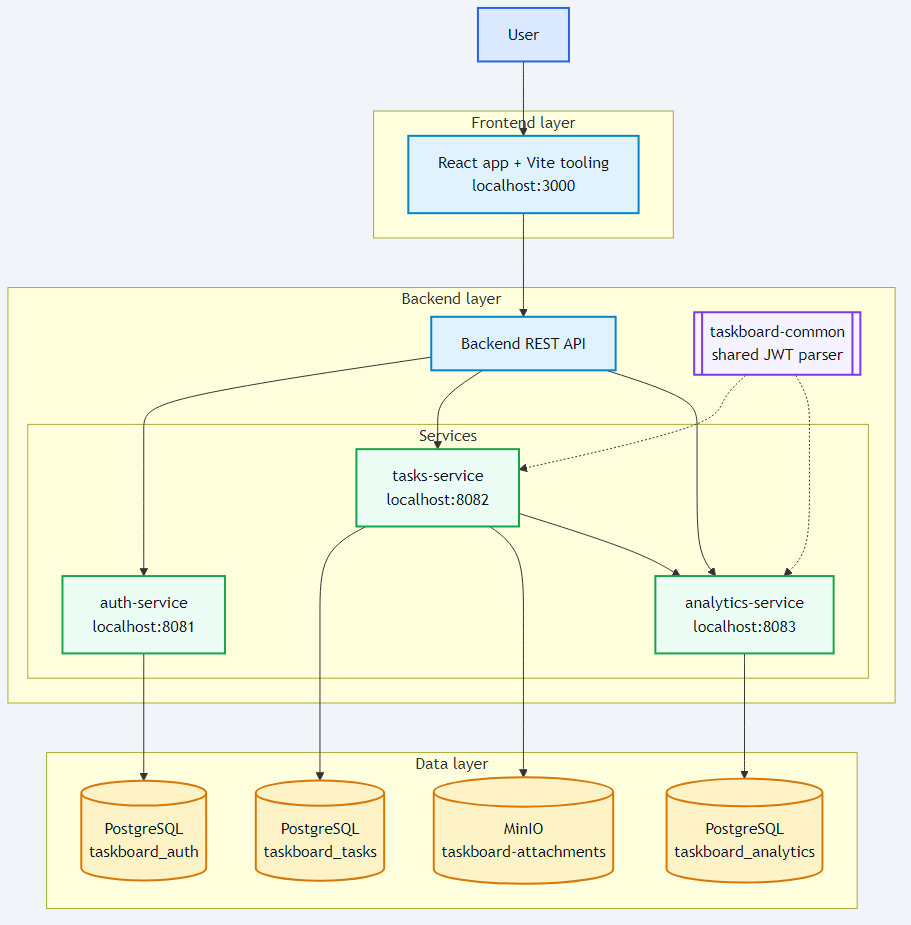
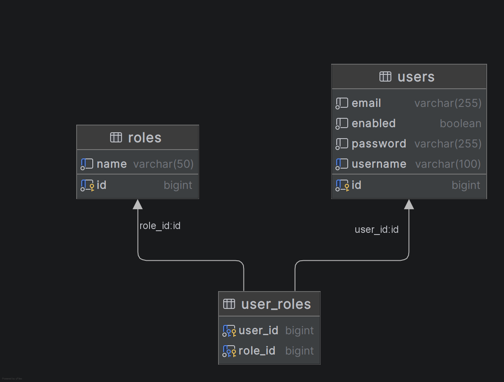
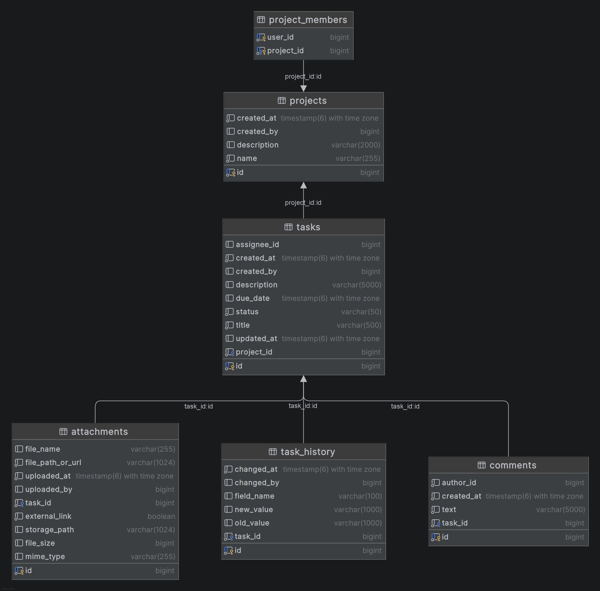
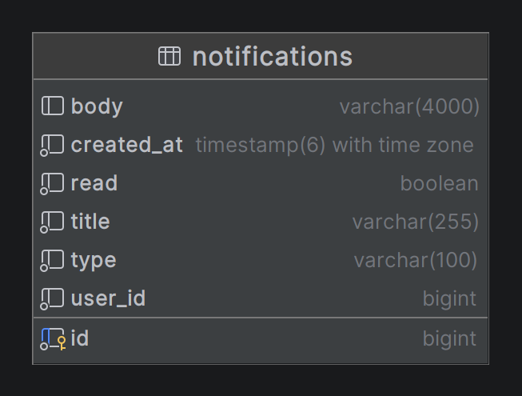

# ОТЧЕТ О ПРОДЕЛАННОЙ РАБОТЕ ПО ВКРБ

## 1. Общие сведения

**ФИО:** Кострюков Евгений Сергеевич  
**Группа:** М8О-407Б-22  
**Тема ВКРБ:** Разработка микросервисного веб-приложения для управления внутренними задачами, проектами и коммуникацией команды.

## 2. Введение

В рамках ВКР разработан MVP-прототип системы для командной работы: постановки задач, контроля статусов, распределения ответственности, хранения рабочей коммуникации и получения оперативных уведомлений.

Актуальность работы связана с необходимостью независимого от внешних SaaS-сервисов решения, которое можно разворачивать локально и адаптировать под собственные требования. Выбранный подход позволяет отработать практику проектирования микросервисной архитектуры, разграничения ответственности сервисов и построения воспроизводимого процесса разработки.

Цель текущего этапа: реализовать, развернуть и верифицировать работоспособный прототип, покрывающий ключевые пользовательские и технические сценарии.

## 3. Архитектура системы

Система построена как набор изолированных backend-сервисов и веб-клиента. Каждый backend-сервис использует собственную базу данных PostgreSQL. Файлы вложений задач хранятся в MinIO.

Клиентское взаимодействие выполняется через REST API с JWT-аутентификацией. Межсервисный обмен событиями (уведомления из `tasks-service` в `analytics-service`) защищен внутренним ключом `NOTIFICATIONS_INTERNAL_KEY`.

### 3.1 Состав сервисов

| Сервис | Порт | База данных | Назначение |
|---|---:|---|---|
| `auth-service` | 8081 | `taskboard_auth` | Регистрация, вход, профиль пользователя, список пользователей |
| `tasks-service` | 8082 | `taskboard_tasks` | Проекты, задачи, комментарии, вложения, история изменений |
| `analytics-service` | 8083 | `taskboard_analytics` | Уведомления, сводные отчеты |
| `frontend` | 3000 | - | Пользовательский веб-интерфейс |

Контроллеры backend-сервисов в основном выполняют транспортную функцию, а прикладные сценарии и проверки прав находятся в сервисном слое. Для `tasks-service` и `analytics-service` используется общий модуль `taskboard-common` (повторно используемая логика JWT resource-server).

### 3.2 Архитектурная схема



Рисунок 1 — Логическая архитектура программной системы.

### 3.3 ER-диаграммы баз данных

ER-модель представлена отдельными диаграммами по каждому сервису, что соответствует границам микросервисной архитектуры.



Рисунок 2 — ER-диаграмма БД `taskboard_auth`.



Рисунок 3 — ER-диаграмма БД `taskboard_tasks`.



Рисунок 4 — ER-диаграмма БД `taskboard_analytics`.

## 4. Используемые технологии

| Компонент | Технологии |
|---|---|
| Backend | Java 17, Spring Boot 3, Spring Data JPA, Spring Security |
| Frontend | React 18, Vite, React Router |
| Frontend unit-тесты | Vitest, Testing Library |
| Хранилища данных | PostgreSQL 16, MinIO |
| Аутентификация | JWT (HS256), BCrypt |
| Инфраструктура | Docker, Docker Compose |
| Сборка | Maven, npm |

## 5. Реализованный функционал

### 5.1 Пользовательский интерфейс

Реализованы основные экраны:

- регистрация и вход;
- Dashboard;
- проекты и карточка проекта;
- задачи и карточка задачи;
- аналитика;
- уведомления;
- профиль пользователя.

Реализованы inline-валидация форм, toast-уведомления, skeleton-состояния и адаптивная навигация.

### 5.2 Функции `auth-service`

- регистрация пользователя;
- вход и выдача JWT;
- проверка JWT;
- получение и обновление профиля;
- смена пароля;
- получение списка пользователей;
- изменение ролей пользователей (`ADMIN` / `MANAGER` / `EXECUTOR`) для администратора.

### 5.3 Функции `tasks-service`

- CRUD проектов;
- управление участниками проекта (`project_members`);
- CRUD задач с фильтрацией;
- комментарии к задачам;
- вложения (upload/download/preview/delete);
- хранение файлов в MinIO и метаданных в PostgreSQL;
- история изменений задач;
- проверки membership/ролей на действия;
- проверка корректности назначения исполнителя (исполнитель должен быть участником проекта);
- отправка внутренних уведомлений в `analytics-service`.

### 5.4 Функции `analytics-service`

- хранение и выдача уведомлений;
- подсчет непрочитанных уведомлений;
- отметка уведомлений как прочитанных;
- SSE-стрим уведомлений;
- отчеты `summary`, `by-project`, `by-assignee` с фильтрацией по периоду;
- экспорт отчета в CSV (Excel-совместимый формат).

## 6. Безопасность

На текущем этапе реализованы:

- JWT-аутентификация защищенных API;
- CORS-настройка для работы веб-клиента с backend в dev-сценариях;
- хранение паролей в виде BCrypt-хеша;
- RBAC-модель (`ADMIN`, `MANAGER`, `EXECUTOR`);
- проверки прав доступа на backend для проектов, задач, комментариев и вложений;
- разграничение доступа по membership-модели;
- запрет доступа к чужим уведомлениям (`userId` из токена);
- защита внутренних межсервисных вызовов ключом `NOTIFICATIONS_INTERNAL_KEY`.

## 7. Логирование и отладка

Реализовано file-based логирование backend-сервисов с ротацией:

- `logs/auth-service/auth-service.log`
- `logs/tasks-service/tasks-service.log`
- `logs/analytics-service/analytics-service.log`

В логах фиксируются `requestId`, `userId` (при наличии), HTTP-метод, endpoint, статус и время обработки.

## 8. Запуск системы

Минимальный запуск:

1. Из корня проекта:

   `docker compose up -d --build`

   или с явной фиксацией портов:

   `docker compose --env-file docker.defaults.env up -d --build`

2. В каталоге `frontend`:

   `npm install`  
   `npm run dev`

3. Открыть `http://localhost:3000`.

Первый зарегистрированный пользователь получает роль `ADMIN`.

## 9. Интерфейс пользователя

Реализованы экраны, перечисленные в п. 5.1 (вход и регистрация, дашборд, проекты, задачи, уведомления, аналитика, профиль). Иллюстрации интерфейса в пояснительной записке к ВКР не включены (в записке фиксируются четыре рисунка: архитектура и три ER-диаграммы). При необходимости снимки экранов можно использовать в презентации или взять из каталога `docs/screenshots/` репозитория.

## 10. Текущее состояние проекта

Реализован и проверен рабочий MVP-прототип. Система покрывает полный базовый цикл: от регистрации пользователя до работы с проектами и задачами, уведомлениями и аналитикой.

Архитектура подготовлена к дальнейшему развитию: сервисы изолированы, границы API определены, окружение воспроизводимо через Docker Compose, процесс проверки поддерживается автоматизированными тестами.

## 11. Тестирование и CI/CD

Используется многоуровневый подход:

1. интеграционные тесты backend (`auth-service`, `tasks-service`, `analytics-service`);
2. unit-тесты backend-компонентов;
3. unit-тесты frontend (Vitest);
4. e2e smoke-тесты (Playwright);
5. CI-пайплайн в GitHub Actions.

### 11.1 Локальный запуск тестов

Основной скрипт: `run-tests.ps1`.

- `-BackendOnly` — только backend;
- `-E2EOnly` — только e2e;
- `-UseHostMaven` — backend через локальный Maven;
- без флагов — полный прогон (backend + Vitest + e2e).

Полный прогон формирует сводку и сохраняет детальные логи в `logs/test-runs/<timestamp>/`.

### 11.2 CI/CD

Файл `.github/workflows/ci.yml` выполняет:

- backend-тесты на `push` и `pull_request`;
- затем frontend unit-тесты (Vitest);
- затем e2e smoke-тесты (Playwright) в подготовленном окружении.

## 12. Заключение

На текущем этапе цели разработки MVP достигнуты: реализована микросервисная система управления задачами и проектами с ролевым доступом, файловыми вложениями, уведомлениями, аналитикой и автоматизированной проверкой качества. Полученный результат может быть использован как основа для финализации ВКР и дальнейшего развития продукта.

## Приложение А. Ключевые API-методы

### Auth Service

- `POST /api/auth/register`
- `POST /api/auth/login`
- `GET /api/auth/me`
- `PUT /api/auth/me`
- `PUT /api/auth/me/password`
- `GET /api/users`
- `PUT /api/auth/users/{id}/roles`

### Tasks Service

- `GET/POST/PUT/DELETE /api/projects`
- `GET/POST/DELETE /api/projects/{id}/members`
- `GET/POST/PUT/DELETE /api/tasks`
- `GET/POST/DELETE /api/tasks/{taskId}/comments`
- `GET/POST/GET/GET/DELETE /api/tasks/{taskId}/attachments/*`
- `GET /api/tasks/{taskId}/history?limit=50`

### Analytics Service

- `GET /api/notifications`
- `GET /api/notifications/unread`
- `GET /api/notifications/stream`
- `PATCH /api/notifications/{id}/read`
- `GET /api/reports/summary`
- `GET /api/reports/by-project`
- `GET /api/reports/by-assignee`
- `GET /api/reports/export`

## Приложение Б. Фрагменты реализации

Ниже приведены ключевые фрагменты из текущей версии проекта, отражающие архитектурные и прикладные решения.

### Листинг 1. «Тонкий» контроллер и разделение command/query (Tasks Service)

```java
@RestController
@RequestMapping("/api/projects")
@RequiredArgsConstructor
public class ProjectController {
    private final ProjectQueryService projectQueryService;
    private final ProjectCommandService projectCommandService;

    @GetMapping
    public List<Project> list(Authentication auth) {
        return projectQueryService.list(auth);
    }

    @PostMapping
    public ResponseEntity<Project> create(@Valid @RequestBody ProjectWriteDto dto, Authentication auth) {
        return projectCommandService.create(dto, auth);
    }
}
```

Фрагмент демонстрирует выбранный подход: HTTP-слой не содержит бизнес-правил и делегирует операции специализированным сервисам чтения/изменения.

### Листинг 2. Ролевые проверки и membership в сервисном слое (Tasks Service)

```java
public ResponseEntity<?> listTasks(Long projectId, Task.TaskStatus status, Long assigneeId,
                                   int page, int size, Authentication auth) {
    Long userId = RoleAuthorization.userId(auth);
    boolean isExecutor = RoleAuthorization.isExecutor(auth);
    var pageable = PageRequest.of(page, size);

    if (isExecutor) {
        List<Long> allowedProjectIds = projectMemberRepository.findProjectIdsByUserId(userId);
        if (allowedProjectIds == null || allowedProjectIds.isEmpty()) {
            return ResponseEntity.ok(Page.empty(pageable));
        }
        if (projectId != null && !allowedProjectIds.contains(projectId)) {
            return ResponseEntity.ok(Page.empty(pageable));
        }
        return ResponseEntity.ok(
            projectId != null
                ? taskRepository.findByProjectAndFilters(projectId, status, assigneeId, pageable)
                : taskRepository.findByProjectIdsAndFilters(allowedProjectIds, status, assigneeId, pageable)
        );
    }
    return ResponseEntity.ok(projectId != null
        ? taskRepository.findByProjectAndFilters(projectId, status, assigneeId, pageable)
        : taskRepository.findAll(pageable));
}
```

Фрагмент показывает ключевое правило: исполнитель видит только задачи проектов, где он состоит участником (`project_members`).

### Листинг 3. Защищенный внутренний API уведомлений (Analytics Service)

```java
@PostMapping("/internal")
public ResponseEntity<NotificationDto> createInternalWithKey(
        @RequestHeader(value = "X-Internal-Key", required = false) String headerKey,
        @RequestBody NotificationDto dto) {
    if (headerKey == null || !headerKey.equals(internalKey)) {
        return ResponseEntity.status(401).build();
    }
    return notificationApplicationService.createInternal(dto);
}
```

Фрагмент отражает разграничение публичного и межсервисного каналов создания уведомлений.

### Листинг 4. Переиспользуемая клиентская пагинация на фронтенде (React hook)

```javascript
export function useClientPagination(rows, { pageSize, search, matchesSearch }) {
  const filtered = useMemo(() => {
    const q = search.trim().toLowerCase();
    if (!q) return rows;
    const match = matchesSearch || defaultMemberRowMatch;
    return rows.filter((row) => match(row, q));
  }, [rows, search, matchesSearch]);

  const totalPages = Math.max(1, Math.ceil(filtered.length / pageSize));
  const [page, setPage] = useState(1);
  useEffect(() => setPage(1), [search]);
  useEffect(() => setPage((p) => Math.min(p, totalPages)), [totalPages]);
  // ...
}
```

Фрагмент иллюстрирует выделение общей UI-логики из страниц в переиспользуемый hook.

### Листинг 5. Единый скрипт локальной верификации (PowerShell)

```powershell
if (-not $E2EOnly) {
  RunDockerMvnTest (Join-Path $workRoot "auth-service") $mvnImage "mvn -B test" $null 1
  RunDockerMvnTest $workRoot $mvnImage "mvn -B -pl tasks-service,analytics-service -am test" "tasks-and-analytics" 25
  Run "npm run test" # Vitest
}
if (-not $BackendOnly) {
  RunWithRetry "docker compose --env-file `"$e2eEnvFile`" up -d --build" 3 5
  Run "npm run test:e2e" # Playwright
}
```

Фрагмент показывает концепцию многоуровневой проверки: backend integration, frontend unit и e2e в одном воспроизводимом сценарии.