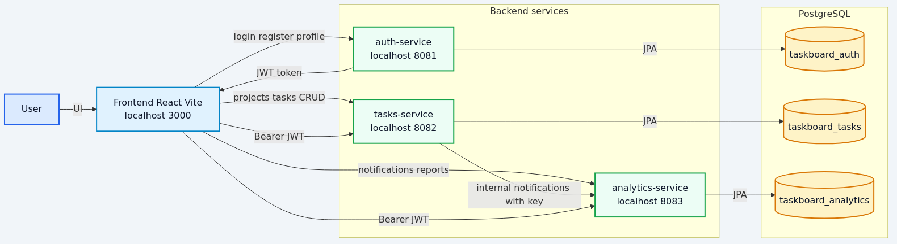
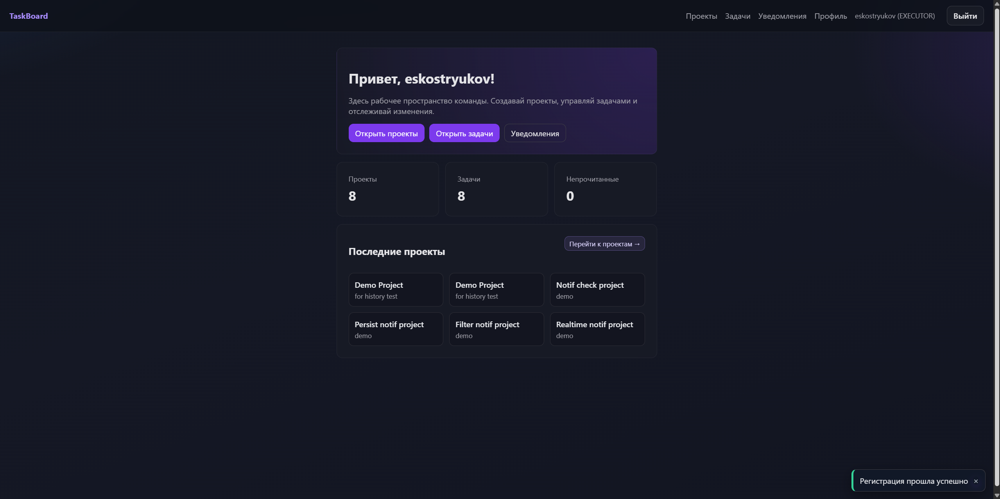
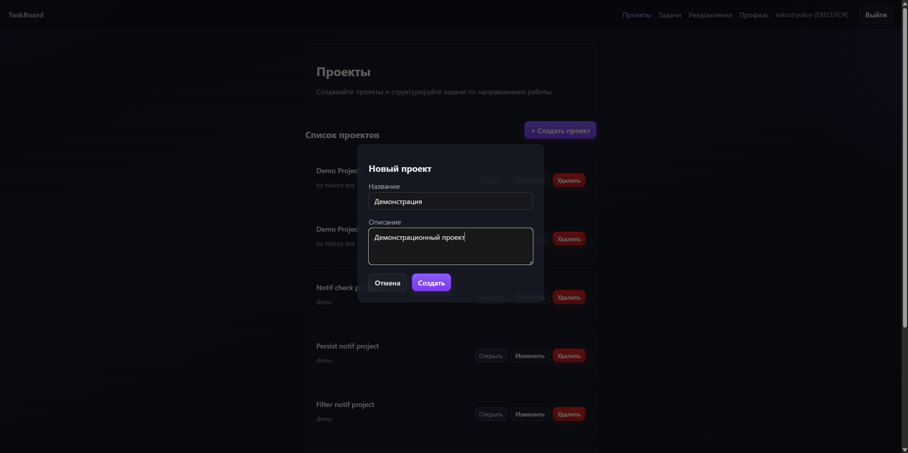
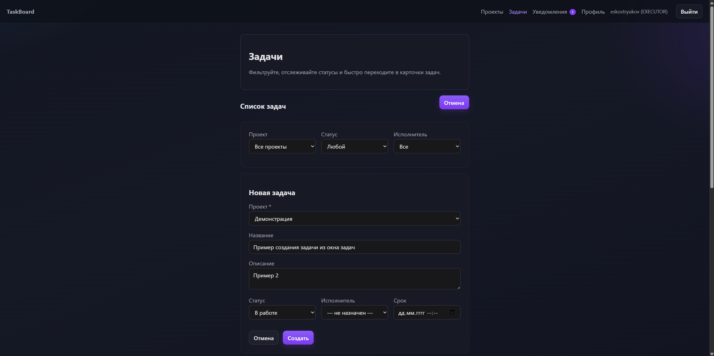
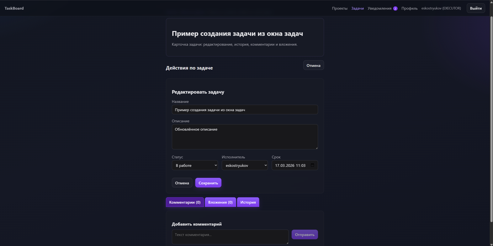
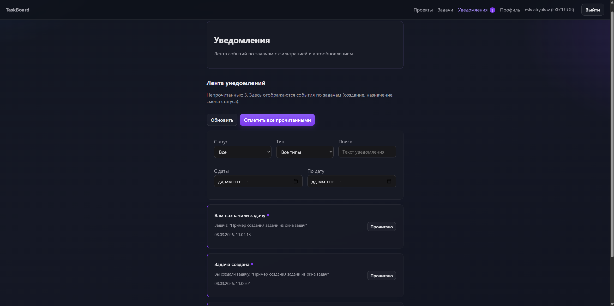
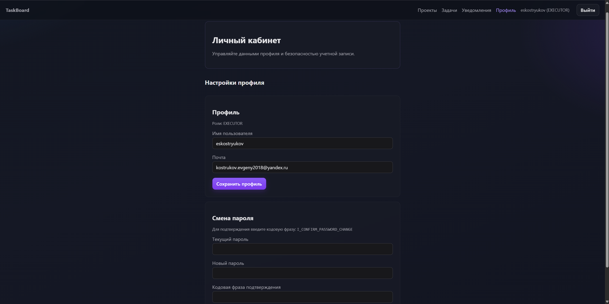

# ОТЧЕТ О ПРОДЕЛАННОЙ РАБОТЕ ПО ВКРБ

## 1. Общие сведения

**ФИО:** Кострюков Евгений Сергеевич  
**Группа:** М8О-407Б-22  
**Тема ВКРБ:** Разработка микросервисного веб-приложения для управления внутренними задачами, проектами и коммуникацией команды.

## 2. Введение

В рамках выполнения выпускной квалификационной работы разрабатывается программная система для организации командной работы: постановки задач, контроля выполнения, распределения ответственности между участниками и сопровождения коммуникации внутри проекта.

Актуальность темы обусловлена тем, что готовые SaaS-решения для управления задачами часто требуют платной подписки, зависят от внешней инфраструктуры и не всегда подходят для учебных или локальных корпоративных сценариев. Разработка собственного решения позволяет получить контролируемую архитектуру, адаптируемую под конкретные требования, а также продемонстрировать практическое применение современных подходов к построению распределенных систем.

Цель текущего этапа — создание и проверка работоспособного MVP-прототипа, включающего основные бизнес-функции, пользовательский интерфейс, механизмы безопасности и средства отладки.

## 3. Архитектура системы

Система построена по микросервисной архитектуре и включает отдельные сервисы аутентификации, задач и аналитики, а также веб-клиент. Каждый backend-сервис использует собственную базу данных PostgreSQL, а файловые вложения задач хранятся в отдельном объектном хранилище MinIO, что обеспечивает логическую изоляцию и упрощает дальнейшее масштабирование.

Взаимодействие между клиентом и бэкендом выполняется через REST API. Для авторизации используется JWT-токен. Внутренние межсервисные вызовы (например, отправка уведомлений из сервиса задач в сервис аналитики) защищены отдельным внутренним ключом.

### 3.1 Состав сервисов

| Сервис | Порт | База данных | Назначение |
|---|---:|---|---|
| `auth-service` | 8081 | `taskboard_auth` | Регистрация, вход, профиль пользователя, список пользователей |
| `tasks-service` | 8082 | `taskboard_tasks` | Проекты, задачи, комментарии, вложения, история изменений |
| `analytics-service` | 8083 | `taskboard_analytics` | Уведомления, сводные отчеты |
| `frontend` | 3000 | - | Пользовательский веб-интерфейс |

### 3.2 Архитектурная схема

Рисунок 1 — Архитектура программной системы.

## 4. Используемые технологии

| Компонент | Технологии |
|---|---|
| Backend | Java 17, Spring Boot 3, Spring Data JPA, Spring Security |
| Frontend | React 18, Vite, React Router |
| Хранилища данных | PostgreSQL 16, MinIO |
| Аутентификация | JWT (HS256), BCrypt |
| Инфраструктура | Docker, Docker Compose |
| Сборка | Maven, npm |

## 5. Реализованный функционал

### 5.1 Пользовательский интерфейс

Реализованы рабочие страницы:

- авторизация и регистрация;
- Dashboard;
- проекты и карточка проекта;
- задачи и карточка задачи;
- уведомления;
- профиль пользователя.

Также реализованы inline-валидация форм, toast-уведомления, адаптивная навигация и skeleton-загрузки.
Дополнительно реализованы элементы ролевого интерфейса: управление ролями пользователей (`ADMIN`) на странице профиля в виде сворачиваемого блока с ленивой загрузкой списка, поиском по имени и адресу электронной почты и пагинацией; управление участниками проекта (приглашение/удаление) в карточке проекта.

### 5.2 Auth Service

Реализованы функции:

- регистрация пользователя;
- вход и выдача JWT;
- проверка JWT;
- получение и обновление профиля;
- смена пароля с валидацией;
- получение списка пользователей (для назначения задач и администрирования): в сводке передаются идентификатор, имя пользователя, адрес электронной почты и набор ролей;
- изменение ролей пользователей (`ADMIN` / `MANAGER` / `EXECUTOR`) через защищенный API-метод для администраторов.

### 5.3 Tasks Service

Реализованы функции:

- CRUD проектов;
- CRUD задач с фильтрацией по проекту, статусу и исполнителю;
- комментарии к задачам;
- вложения к задачам;
- загрузка вложений через multipart API, хранение файлов в MinIO и хранение метаданных в PostgreSQL;
- просмотр изображений и текстовых файлов в UI, скачивание любых форматов;
- история изменений задач;
- управление участниками проекта через отдельную таблицу membership (`project_members`);
- проверка доступа к проектам/задачам через membership и ролевые ограничения;
- отправка внутренних уведомлений в analytics-service при событиях в задачах.

### 5.4 Analytics Service

Реализованы функции:

- хранение уведомлений в PostgreSQL;
- получение списка уведомлений с фильтрацией;
- подсчет непрочитанных уведомлений;
- отметка уведомления как прочитанного;
- API сводной отчетности (`summary`, `by-project`, `by-assignee`) с фильтрацией по периоду `from/to`;
- экспорт отчета в CSV, адаптированный для Excel (UTF-8 BOM, русские подписи, читаемый формат даты/времени);
- фронтенд-вкладка аналитики: KPI-блок, динамика периода, распределение по статусам (кольцо/столбцы), топ проектов и топ исполнителей.

## 6. Безопасность системы

На текущем этапе обеспечены следующие меры безопасности:

- JWT-аутентификация для защищенных API-методов;
- хранение паролей в виде BCrypt-хеша;
- ролевая модель доступа (RBAC) с ролями `ADMIN`, `MANAGER`, `EXECUTOR`, включенными в JWT;
- централизованные проверки прав на уровне backend-контроллеров (проекты, задачи, комментарии, вложения);
- разграничение доступа к проектам через membership-модель (таблица `project_members`);
- хранение содержимого вложений в MinIO и выдача файлов только через защищенные endpoint `tasks-service` (по JWT);
- запрет доступа к уведомлениям других пользователей (фильтрация по `userId` из токена);
- защита внутренних межсервисных уведомлений через `NOTIFICATIONS_INTERNAL_KEY`;
- принудительная привязка `userId` к аутентифицированному пользователю для публичных операций создания уведомлений.

## 7. Логирование и отладка

Для сопровождения и диагностики реализовано централизованное file-based логирование backend-сервисов с ротацией логов. В логах фиксируются:

- идентификатор запроса (`requestId`);
- идентификатор пользователя (`userId`, если доступен);
- HTTP-метод, endpoint, статус ответа и время выполнения.

Логи сервисов доступны в отдельных файлах:

- `logs/auth-service/auth-service.log`;
- `logs/tasks-service/tasks-service.log`;
- `logs/analytics-service/analytics-service.log`.

Это позволяет проводить анализ поведения системы без подключения к контейнерам.

## 8. Запуск системы

Для локального запуска системы используется Docker Compose.

Последовательность действий:

1. Выполнить команду для запуска backend-сервисов и баз данных:

`docker-compose up -d --build`

2. Перейти в каталог frontend и запустить веб-интерфейс:

`npm install`
`npm run dev`

После запуска приложение будет доступно по адресу:
http://localhost:3000

## 9. Интерфейс пользователя (ключевые экраны)

Ниже приведены ключевые экраны, отражающие основной пользовательский сценарий.

Рисунок 2 — Экран входа/главной страницы после авторизации.

Рисунок 3 — Работа с проектами.

Рисунок 4 — Создание и просмотр задач.

Рисунок 5 — Детали задачи и ее редактирование.

Рисунок 6 — Раздел уведомлений.

Рисунок 7 — Профиль пользователя.

## 10. Текущее состояние проекта

На текущий момент реализован и проверен рабочий MVP-прототип системы. Поддерживается полный базовый цикл работы с проектами и задачами через веб-интерфейс: от регистрации пользователя до постановки задач, изменения статусов, ведения истории изменений и получения уведомлений.
Реализована и проверена базовая ролевая модель и сценарии командной работы: администрирование ролей, управление участниками проекта и контроль прав на операции с задачами.

Архитектура решения является расширяемой: сервисы изолированы, API-границы определены, инфраструктура развертывания стандартизирована через Docker Compose, что позволяет переходить к следующему этапу развития без архитектурного пересмотра ядра системы.

## 11. Автоматизированное тестирование и CI/CD

На текущем этапе реализована многоуровневая стратегия тестирования, ориентированная на снижение регрессий и сокращение объема ручной проверки:

1. **Integration-тесты backend-сервисов** (`auth-service`, `tasks-service`, `analytics-service`);
2. **E2E smoke-тест** ключевого пользовательского сценария через Playwright;
3. **CI pipeline** с автоматическим запуском тестов в GitHub Actions.

### 11.1 Integration-тесты backend

Интеграционные тесты построены на Spring Boot Test + MockMvc и запускаются в профиле `test` с in-memory БД H2 (`application-test.yml` в каждом сервисе). Такой подход позволяет:

- изолировать тестовые данные от рабочих PostgreSQL-контуров;
- проверять бизнес-правила и API-контракты на уровне реальных контроллеров/сервисов;
- быстро воспроизводить критичные сценарии (`RBAC`, membership, уведомления, вложения, авторизация).

### 11.2 E2E smoke-тест

E2E-сценарий реализован в `frontend/tests-e2e/smoke.spec.js` и покрывает сквозной пользовательский поток:

- создание проекта через UI;
- подготовка данных (участник/задача) через API для повышения стабильности smoke;
- проверка доставки уведомления исполнителю в UI.

### 11.3 Локальный запуск и developer workflow

Для разработчиков реализован единый скрипт `run-tests.ps1`:

- `-BackendOnly` — только integration backend;
- `-E2EOnly` — только e2e;
- `-VerboseBackendLogs` — подробный Maven-лог backend в консоль;
- без параметров — полный прогон.

Скрипт автоматически поднимает изолированный временный compose-стек для e2e, подбирает свободные порты и выполняет cleanup (`docker compose down -v`), что исключает накопление временных контейнеров/томов.
Для backend-части используется общий Maven cache (`.cache/m2`), что сокращает повторные скачивания зависимостей при последующих прогонах.
Во время длительных backend-шагов в консоль выводятся heartbeat-сообщения о прогрессе выполнения сервиса.
По завершении backend-тестов выводится краткая сводка (`Backend summary`) и итоговый KPI-блок (`Backend KPI`), а полный лог каждого сервиса сохраняется в `logs/test-runs/<timestamp>/`.

### 11.4 CI/CD

Файл `.github/workflows/ci.yml` запускает:

- backend-тесты на каждом `push` и `pull_request`;
- e2e smoke после успешного backend-джоба.

Таким образом, тесты встроены в ежедневный процесс разработки и выполняют роль обязательного quality gate перед слиянием изменений.

## 12. Заключение

В рамках текущего этапа достигнута основная цель: создан и протестирован работоспособный прототип микросервисного приложения для командного управления задачами и проектами. Реализованы ключевые функциональные и технические требования, подтверждена корректность архитектурных решений, а также подготовлена база для дальнейшего развития проекта до финальной версии ВКРБ. Оформление итоговой версии пояснительной записки будет приведено к полному соответствию требованиям ГОСТ на этапе финализации.

## Приложение А. Ключевые API-методы

### Auth Service

- `POST /api/auth/register` — регистрация пользователя;
- `POST /api/auth/login` — вход и получение JWT;
- `GET /api/auth/me` — получение профиля;
- `PUT /api/auth/me` — обновление профиля;
- `PUT /api/auth/me/password` — смена пароля;
- `GET /api/users` — список пользователей (`id`, `username`, `email`, `roles`);
- `PUT /api/auth/users/{id}/roles` — изменение роли пользователя (для администратора).

### Tasks Service

- `GET /api/projects`, `POST /api/projects`, `PUT /api/projects/{id}`, `DELETE /api/projects/{id}`;
- `GET /api/projects/{id}/members`, `POST /api/projects/{id}/members`, `DELETE /api/projects/{id}/members/{userId}`;
- `GET /api/tasks`, `POST /api/tasks`, `PUT /api/tasks/{id}`, `DELETE /api/tasks/{id}`;
- `GET /api/tasks/{taskId}/comments`, `POST /api/tasks/{taskId}/comments`;
- `GET /api/tasks/{taskId}/attachments`, `POST /api/tasks/{taskId}/attachments/upload`, `GET /api/tasks/{taskId}/attachments/{id}/download`, `GET /api/tasks/{taskId}/attachments/{id}/preview`, `DELETE /api/tasks/{taskId}/attachments/{id}`;
- `GET /api/tasks/{taskId}/history?limit=50`.

### Analytics Service

- `GET /api/notifications/stream` (SSE) — поток realtime-уведомлений для текущего пользователя;
- `GET /api/notifications` — список уведомлений;
- `GET /api/notifications/unread` — количество непрочитанных;
- `PATCH /api/notifications/{id}/read` — отметить как прочитанное;
- `GET /api/reports/summary` — краткая сводка;
- `GET /api/reports/by-project` — агрегация по проектам;
- `GET /api/reports/by-assignee` — агрегация по исполнителям;
- `GET /api/reports/export` — экспорт отчета в CSV (Excel-совместимый формат).